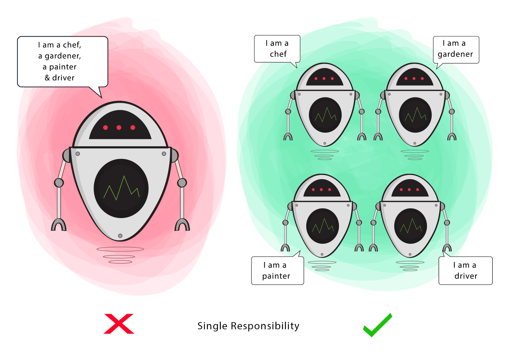

# SOLID 원칙

---

# 개요

- 유지 보수가 쉽고 유연한 소프트웨어를 만들기 위한 디자인 원칙

```java

SRP(Single Responsibility Principle) : 단일 책임 원칙
- 어떤 클래스를 변경해야 하는 이유는 오직 하나 뿐이어야 한다.

OCP(Open Closed Principle) : 개방 폐쇄 원칙
- 자신의 확장에는 개방돼 있고, 주변의 변화에 대해서는 폐쇄돼 있어야 한다.

LCP(Liskov Segregation Principle) : 리스코프 치환 원칙
- 서브 타입은 언제나 자신의 기반 타입으로 교체할 수 있어야한다.

ISP(Interface Segregation Principle) : 인터페이스 분리 원칙
- 클라이언트는 자신이 사용하지 않는 메서드에 의존관계를 맺으면 안된다.

DIP(Dependency Inversion Principle) : 의존 역전 원칙
- ≠ DI(의존성 주입)
- 자신보다 변하기 쉬운 것에 의존하지 마라.
```

---

# `S`ingle `R`esponsibility `P`rinciple

- SRP의 목적은 행동들을 분리하는 것이고, 이로 인해 어떤 기능을 수정하더라도, 연관없는 기능에는 영향이 가지 않게 될 것임.



- [https://medium.com/backticks-tildes/the-s-o-l-i-d-principles-in-pictures-b34ce2f1e898](https://medium.com/backticks-tildes/the-s-o-l-i-d-principles-in-pictures-b34ce2f1e898)

## 이점

- 테스트 케이스가 줄어든다.
- 객체의 의존성이 줄어들어, 결합도가 낮아진다.
- 복잡한 책임으로 구성된 클래스 보다 단일 책임으로 구성된 클래스가 찾기 편하다.
    - 오류 탐색 등..

## SRP 위반 사례

- 하나의 클래스에 두 가지 역할(쓰기, 출력)


## SRP 적용 사례

- 단일 책임으로 각각의 클래스로 분리


```java
영어 실력이 좋지 못해 잘못된 내용이 있을 수 있습니다.

원문: https://www.baeldung.com/java-single-responsibility-principle
```

## SRP 주의할 점

하지만, 이 원칙은 어떻게 지켜야 하는 지에 대해서 명확한 지침이 없기 때문에, 

클래스의 책임에 대한 해석은 개발자의 몫이다. 

따라서 SRP를 지킨다는 것은 위 간단한 예제처럼 쉬운 문제가 아닐 수 있다.

SRP를 구현하려면 개발자가 클래스의 책임을 명확하게 인지하고 정의할 수 있어야 하는데

모든 개발자들은 자신의 설계에 대한 나름의 목적과 주관적인 이유를 가지고 있기 때문에 

이 원칙을 잘못 이해하고 설계할 수 있다.

그렇다면, 만약 개발자가 SRP 원칙을 `무작정` 따르기 위해 클래스 마다 한 가지의 기능을 

고수하게 됐을 때 발생할 수 있는 문제에 대해서 살펴보자.

아래 그림의 문자 조작 클래스는 어떤 책임이 있는지 명확하게 알 수 있다.


여기서 만약 위 그림에 정의된 클래스처럼 응집도와 책임에 대한 생각을 명확하게 정의 내리지 못했다고 해보자.

그럼 글을 작성하고, 업데이트하는 기능을 두 가지 책임으로 생각할 수도 있다.

이러한 생각에 따라, 두 개의 클래스 (WriteText, UpdateText)로 분리 해야겠다고 생각할 수 있다.

결과적으로 `강한 결합도`와 `느슨한 응집도`의 두 개의 클래스가 생성될 것이다.

하지만 이 두 클래스는 거의 함께 사용될 것이며,  (* 이 부분 이해를 완벽하게 하지 못함 )

기본적으로 문자를 조작한다는 하나의 목적을 가지고 있으므로, 클래스를 분리한 것은 잘못된 생각이다.

따라서 핵심은 과하게 생각하지 않고, 모든 클래스의 책임을 명확하게 인지하고 응집도에 대한 생각을 하는 것이 중요하다.

# `O`pen-`C`losed `P`rinciple

- 소프트웨어 엔티티(클래스, 모듈, 함수 등)는 확장에 대해서는 열려있어야 하지만, 변경에 대해서는 닫혀 있어야 한다.
- 따라서, 기존 코드를 수정함으로써 발생할 수 있는 잠재적인 원인을 사전에 차단할 수 있다.
- 기존 코드를 수정할 수 있는 예외: `버그 Fix`
- OCP(개방-폐쇄 원칙)과 DIP(제어의 역전)과 밀접한 연관이 있는 것 같다.

## OCP 위반 사례

- 새로운 유형의 계좌 클래스가 추가될 경우 기존 코드를 `수정` 해야하는 문제점이 있음.


## OCP 적용 사례

- 변경이 잦은 계좌 클래스들을 Account 라고 하는 추상 클래스 혹은 인터페이스에 의존하게 만듬.
- 이제 `BankingAppWithDrawalService`는 계좌유형이 추가돼도 코드를 수정하지 않아도 됨.
- DIP(의존성 역전 원칙)도 준수됨.


# `L`iskov `S`ubstitution `P`rinciple


- [https://medium.com/backticks-tildes/the-s-o-l-i-d-principles-in-pictures-b34ce2f1e898](https://medium.com/backticks-tildes/the-s-o-l-i-d-principles-in-pictures-b34ce2f1e898)

- 서브 타입은 언제나 자신의 기반 타입(`상위 타입`)으로 교체할 수 있어야 한다. (`다형성`)
- 이 말은 하위 타입은 상위 타입의 규칙(메소드, 행위)을 `빠짐없이` 모두 지켜야 한다는 것이다.
- "다형성이 있는 코드 블락 안에서 타입을 검사하는 코드가 있으면 리스코프 치환 원칙을 어기고 있을 가능성이 있다." -Liskov Substitution Principle "Is-Substitutable-For" Not Just "Is-A"

## LSP 위반 사례


- 그림 출처: [https://medium.com/@elegantjoo/lsp-liskov-substitution-principle-리스코프-치환-원칙-ca4e76202279](https://medium.com/@elegantjoo/lsp-liskov-substitution-principle-%EB%A6%AC%EC%8A%A4%EC%BD%94%ED%94%84-%EC%B9%98%ED%99%98-%EC%9B%90%EC%B9%99-ca4e76202279)

## LSP 적용 사례


- 그림출처: [https://medium.com/@elegantjoo/lsp-liskov-substitution-principle-리스코프-치환-원칙-ca4e76202279](https://medium.com/@elegantjoo/lsp-liskov-substitution-principle-%EB%A6%AC%EC%8A%A4%EC%BD%94%ED%94%84-%EC%B9%98%ED%99%98-%EC%9B%90%EC%B9%99-ca4e76202279)

## 그렇다면, 오리와 오리 장난감은 LSP를 위반한 것일까?


- 결론적으로는 클라이언트의 관점과 사용 방식에 따라 다르게 해석될 수 있다.

```java
## 아직 완벽하게 이해하지 못한 부분

단순히 서브타입과 상위타입의 문제가 아니라 이를 의존하고 있는 클라이언트에게 적합한지를 생각해야 한다.

- 클라이언트가 오리를 호수에 `떠있는 한 개체`로 생각한다면, 배터리가 없는 오리 장난감으로도 충분히 대체 될 수 있다.
- 이를 사용하고 있는 클라이언트가 어떤 식으로 객체를 사용하고 있는지 거시적인 관점에서 생각해봐야 한다.

```

# `I`nterface `S`egregation `P`rinciple


- [https://medium.com/backticks-tildes/the-s-o-l-i-d-principles-in-pictures-b34ce2f1e898](https://medium.com/backticks-tildes/the-s-o-l-i-d-principles-in-pictures-b34ce2f1e898)

- 클라이언트는 사용하지 않는 메서드에 대해 의존적이지 않아야 합니다.
- 클래스가 서로 관계없는 기능들을 가지고 있다면 낭비가 되고, 예상치 못한 버그를 발생 시킬 수 있습니다.

## ISP 위반 사례

```java
public interface BearKeeper {
    void washTheBear();
    void feedTheBear();
    void petTheBear();
}
```

## ISP 적용 사례

```java
public interface BearCleaner {
    void washTheBear();
}

public interface BearFeeder {
    void feedTheBear();
}

public interface BearPetter {
    void petTheBear();
}
```

# `D`ependency `I`nversion `P`rinciple


- [https://medium.com/backticks-tildes/the-s-o-l-i-d-principles-in-pictures-b34ce2f1e898](https://medium.com/backticks-tildes/the-s-o-l-i-d-principles-in-pictures-b34ce2f1e898)

- `추상`(abstraction)은 `구체`(detail)에 의존하지 않아야 하며, `구체`는 `추상`에 의존적이어야 합니다.
- `고수준의 모듈`은 `저수준의 모듈`에 의존적이면 안되고, 둘 다 `추상`에 의존적이어야 합니다.

```java
고수준 모듈 (또는 클래스): 도구와 함께 동작하는 클래스.
저수준 모듈 (또는 클래스): 수행하기 위한 도구.
추상: 두 클래스를 연결하는 인터페이스
구체: 도구가 동작하는 방법
```

- DIP는, 액션을 수행할때 클래스가 도구와 융합되면 안된다고 말합니다. 보다 좋은 방법은 인터페이스와 융합하여 클래스와 도구를 연결하는 것 입니다.

## DIP 위반 사례

- Windows98Machine 클래스의 테스트가 어려워질 뿐만 아니라, 키보드와 모니터가 종속되어 다른 모델로 전환할 수가 없어졌음.
- DIP의 목적은 인터페이스를 통해 고수준 클래스가 저수준 클래스에 대해 의존성을 가지는 것을 줄이는 것 입니다.

```java
public class Windows98Machine {

    private final StandardKeyboard keyboard;
    private final Monitor monitor;

    public Windows98Machine() {
        monitor = new Monitor();
        keyboard = new StandardKeyboard();
    }

}
```

## DIP 적용 사례

- 위와 같은 문제를 없애기 위해, Windows98Machine 클래스에 키보드 인터페이스 의존성을 주입

```java
public class StandardKeyboard implements Keyboard { }

public class Windows98Machine{

    private final Keyboard keyboard;
    private final Monitor monitor;

    public Windows98Machine(Keyboard keyboard, Monitor monitor) {
        this.keyboard = keyboard;
        this.monitor = monitor;
    }
}
```

---

# 결론

```java

SOLID는 "객체 지향"을 올바르게 프로그램에 녹여내기 위한 원칙이다.

SOLID는 갑자기 하늘에서 떨어진 것이 아니라 "객체 지향 4대 특성(캡! 상추다)"을 제대로 활용한 결과로 당연히 나타나는 것이다.
따라서 "객체 지향 4대 특성"을 제대로 이해해야 SOLID를 제대로 이해하고 활용할 수 있음을 기억하자. 

SOLID를 이야기 할 때 빼놓을 수 없는것이 "SoC"다.

"SoC"는 관심사의 분리("Separation Of Concerns")이다.
관심이 같은 것 끼리는 하나의 객체 안으로 또는 친한 객체로 모으고,
관심이 다른 것은 가능한 한 따로 떨어져 서로 영향을 주지 않도록 분리하라는 것이다.
하나의 속성, 하나의 메서드, 하나의 클래스, 하나의 모듈, 또는 하나의 패키지에는 하나의 관심사만 들어있어야 한다는 것이 "SoC"다.

한마디로 "관심사가 다르고 변화의 시기가 다르면 분리해야 한다는 것이다."

SoC를 적용하면 자연스럽게 "단일 책임 원칙(SRP)", "인터페이스 분리 원칙(ISP)", "개방 폐쇄 원칙(OCP)"에 도달하게 된다.

스프링 또한 SoC를 통해 SOLID를 극한까지 적용하고 있다.

SOLID 원칙을 적용하면 소스 파일의 개수는 더 많아지는 경향이 있다.

하지만 이렇게 많아진 파일들이 논리를 더욱 잘 분할하고, 
잘 표현하기에 이해하기 쉽고, 개발하기 쉬우며, 유지와 관리, 보수하기 쉬운 소스가 만들어진다. SOLID 원칙을 적용함으로써 얻는 혜택에 비하면 늘어는 소스 파일 개수에 대한 부담은 충분히 감수하고도 남을 만하다.

출처 : 스프링 입문을 위한 자바 객체지향의 원리와 이해 - 김종민 저
```

---

# Reference.

- 스프링 입문을 위한 자바 객체지향의 원리와 이해 - 김종민 저
- Baeldung  (www.baeldung.com)
  - A Solid Guide to SOLID Principles
  - Single Responsibility Principle in Java
  - Open/Closed Principle in Java
  - Liskov Substitution Principle in Java
- LSP(리스코프 치환 원칙) - 오리와 오리장난감은 진짜 LSP 위반일까?
    - https://siyoon210.tistory.com/156

- [https://medium.com/backticks-tildes/the-s-o-l-i-d-principles-in-pictures-b34ce2f1e898](https://medium.com/backticks-tildes/the-s-o-l-i-d-principles-in-pictures-b34ce2f1e898)
- [https://blog.siner.io/2020/06/18/solid-principles/](https://blog.siner.io/2020/06/18/solid-principles/)
