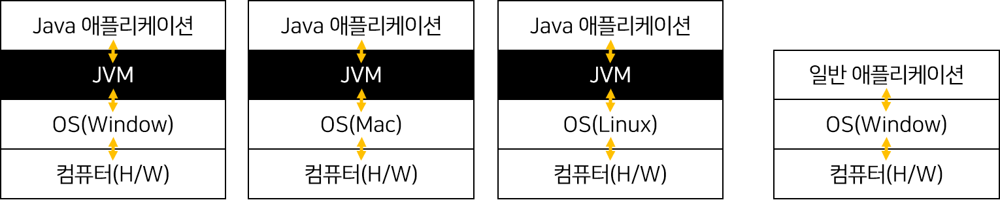
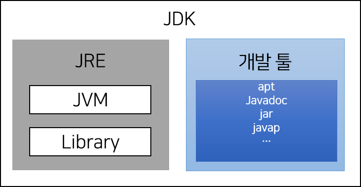

# 1주차 과제: JVM은 무엇이며 자바 코드는 어떻게 실행하는 것인가.


자바 소스 파일(.java)을 JVM으로 실행하는 과정 이해하기.


[TOC]

---

### 플랫폼 종속?

---


##### C/C++ 는 컴파일 플랫폼과 타겟 플랫폼이 다를 경우, 프로그램이 동작 X

- ##### 이유?

  - OS마다 지원하는 `시스템콜 인터페이스`가 다름
  - CPU 아키텍처마다 `명령어 집합구조`(Instruction set architerture) 가 다름


##### 위와 같은 문제를 해결법

- Cross Compile
  - C나 C++ 진영은 타겟 플랫폼에 맞춰 `크로스 컴파일` 을 할 수 있음.
- JVM


> ### TMI
>
> 
>
> `환경, 플랫폼`: 운영체제 + CPU 아키텍처
>
> `명령어`: CPU가 수행할 동작을 바이너리 코드로 정의한 것
>
> `명령어 집합`: 특정 CPU를 위해 정의된 명령어의 모임
>
> `명령어 집합구조`: 프로그램을 수행할 하드웨어 사이의 인터페이스에 대한 완전한 정의 및 명세


---

### JAVA 역사

---


- ##### 1991년 Sun의 엔지니어들이 `가전제품`에 탑제될 소프트웨어 Oak 라는 언어 개발

- ##### 여러 종류의 운영체제를 사용하는 컴퓨터들이 통신하는 **인터넷** 이 등장하자 운영체제에 독립적인 Oak를 인터넷에 적합하도록 개발방향으로 바꾸면서 이름을 Java로 변경

- ##### 웹 브라우저에 자바 가상 머신을 탑재해 서버의 `.class` 파일을 처리하는 것을 목표로 하기도 했다. ( 하지만 결국.. 자바스크립트가.. )


---

### JVM이란 무엇인가

---


##### 가상머신

- S/W로 구현된 H/W

| HW          | SW                     |
| ----------- | ---------------------- |
| TV와 비디오 | 윈도우 미디어 플레이어 |
| 오디오      | 윈앰프(winamp), 멜론   |


##### JVM (**J**ava **V**irtual **M**achine)

- `자바를 실행하기 위한 가상 컴퓨터`

- 실제 컴퓨터가 아닌 S/W로 구현된, 컴퓨터속의 컴퓨터\

- Java bytecode로 컴파일 될 수 있는 다른 언어도 실행 가능

  
  
  
  
  

|      | 일반 애플리케이션 |         Java 애플리케이션         |
| :--: | :---------------: | :-------------------------------: |
|  OS  |      종속적       | 독립적<br />단, JVM은 OS에 종속적 |

- 썬에서는 많이 사용되는 주요 OS용 JVM을 제공함으로써, WORA("Write once, run anywhere")을 가능하게 함.


---

### 컴파일 하는 방법

---


```java
# Main.java
    
public class Main {
    public static void main(String[] args) {
        double position = 1.0;
        double initial = 1.0;
        double rate = 1.0;
      
        position = initial + rate * 60;
    }
}
```


-  JVM 자체는 자바 파일을 실행시키는 것이 아니라 Java 바이트코드를 실행시켜주는 것이므로, 우리는 한 단계의 컴파일 과정을 일단 해줘야함.

```java
> javac Main.java
```

- 컴파일은 JDK에 있는 자바컴파일러(javac.exe)를 사용해서 `소스파일.java` 로 부터 **JVM**이 실행할 수 있는 `소스파일.class` 파일을 생성함.


- 생성된 바이트코드(.class)를 조금 더 이해하기 쉽게 보려면 아래와 같은 명령어를 사용(역어셈블)
- ` -c`:  사람이 읽을 수 있게 해석을 해서 디스플레이 해주는 옵션
- ` -v`:  좀 더 자세히 표현됨

```java
> javap -c 소스파일.class

Classfile /C:/Users/psh/Documents/Web/study-java/Week1/noel/sample/Main.class
  Last modified 2021. 5. 8; size 294 bytes
  MD5 checksum 53c526e979e4e7ff3f52bbb376b37e7a
  Compiled from "Main.java"
public class Main
  minor version: 0
  major version: 52
  flags: ACC_PUBLIC, ACC_SUPER
Constant pool:
   #1 = Methodref          #5.#14         // java/lang/Object."<init>":()V
   #2 = Double             60.0d
   #4 = Class              #15            // Main
   #5 = Class              #16            // java/lang/Object
   #6 = Utf8               <init>
   #7 = Utf8               ()V
   #8 = Utf8               Code
   #9 = Utf8               LineNumberTable
  #10 = Utf8               main
  #11 = Utf8               ([Ljava/lang/String;)V
  #12 = Utf8               SourceFile
  #13 = Utf8               Main.java
  #14 = NameAndType        #6:#7          // "<init>":()V
  #15 = Utf8               Main
  #16 = Utf8               java/lang/Object
{
  public Main();
    descriptor: ()V
    flags: ACC_PUBLIC
    Code:
      stack=1, locals=1, args_size=1
         0: aload_0
         1: invokespecial #1                  // Method java/lang/Object."<init>":()V
         4: return
      LineNumberTable:
        line 1: 0

  public static void main(java.lang.String[]);
    descriptor: ([Ljava/lang/String;)V
    flags: ACC_PUBLIC, ACC_STATIC
    Code:
      stack=6, locals=7, args_size=1
         0: dconst_1
         1: dstore_1
         2: dconst_1
         3: dstore_3
         4: dconst_1
         5: dstore        5
         7: dload_3
         8: dload         5
        10: ldc2_w        #2                  // double 60.0d
        13: dmul
        14: dadd
        15: dstore_1
        16: return
      LineNumberTable:
        line 3: 0
        line 4: 2
        line 5: 4
        line 7: 7
        line 8: 16
}
SourceFile: "Main.java"

```


> ### 제인짱짱
>
> 
>
> 상위 버전의 바이트 코드는 하위버전의 자바 프로그램을 실행할 수 없다. 
>
> → Java 14 버전으로 컴파일하고, Java 8 프로그램을 돌리면 UnsupportedClassVersionError가 발생한다.


- (참고) JVM Instruction Set:  https://docs.oracle.com/javase/specs/jvms/se7/html/jvms-6.html 

- (참고) 바이트코드 분석 예제 포스팅 : https://blog.naver.com/pcmola/222049764039


---

### 실행하는 방법

---


바이트코드 파일이 생성됐다면, 아래 명령어를 입력한다.

```java
> java 소스파일
    
Hello World!
```


---

### 바이트코드란 무엇인가

---


##### 바이트코드는 기계어는 아니지만 가상 머신에 의해 기계어로 손쉽게 변환할 수 있는 코드

##### JVM에서 실행되는 바이너리 코드

- 위 각각의 Opcode(명령코드)들이 한 바이트를 의미해서 바이트코드라고 한다.

- 1 byte = 2^8 = 256 개의 명령어를 만들 수 있음.

  

> ### 우디 짱짱
>
> 
>
> #### ✨ 자바 바이트코드 != 바이트코드
>
> - 파이썬 바이트코드...
> - 범용적인 의미, 소스코드와 기계어 사이에 있는 중간언어

---

### JIT 컴파일러란 무엇이며 어떻게 동작하는지

---


##### 과거 자바가 느렸던 이유

- 자바 애플리케이션은 JVM을 한번 더 거친다.

- H/W에 맞게 완전히 컴파일된 상태가 아니다.

- 실행시에 해석(interpret)

  

##### Java는 동적 컴파일 언어

- CPU가 이해할 수 있는 *기계언어가 아닌* **JVM이 이해 할 수 있는 바이트 언어**로 컴파일한 뒤 인터프리터에 의해 실시간으로 번역되어 실행된다.

  

##### 인터프리트 언어

- 실행 중 프로그래밍 언어를 읽어가면서 해당 기능에 대응하는 기계어 코드를 실행

  

##### 정적 컴파일 언어

-  실행하기 전에 프로그램 코드를 기계어로 번역

- 컴파일에 시간이 오래 걸리는 반면 컴파일 후 결과물(.exe)은 **CPU가 이해할 수 있는 기계어**

  

##### JIT 컴파일러는 두 가지의 방식을 혼합한 방식으로 생각할 수 있음

- 실행 시점(Just-In-Time)에서 인터프리트 방식으로 기계어 코드를 생성하면서 그 코드를 캐싱하여, 같은 함수가 여러 번 불릴 때 매번 기계어 코드를 생성하는 것을 방지

- 일반적인 인터프러터 언어에 비해 훨씬 좋은 성능을 냄

  

  > ### 제인, 쿠퍼  짱짱
  >
  > - 자바6
  >   - 클라이언트/서버 컴파일러?
  > - 자바8
  >   - tiered compilation 기본옵션 설정?
  > - 컴파일 에러 vs 런타임 에러 중 어떤게 
  >   - 컴파일 에러, 경험으로 맞추는 EZ
  >
  >   - 런타임에러를 최대한 컴파일 에러로 유도 (이펙티브 자바)
  >
  
  
  
- (참고) https://sowhat4.tistory.com/61

- (참고) https://ko.wikipedia.org/wiki/JIT_%EC%BB%B4%ED%8C%8C%EC%9D%BC

  

---

### JVM 구성 요소

---


#### ClassLoader Subsystem

- JRE의 일부로, 바이트코드를 실행할 때 class 객체를 메모리에 생성

- 클래스의 인스턴스를 생성하면 Class Loader를 통해 메모리에 로드한다.

  

> - 동적으로 클래스 로딩 가능
>
> - ##### Loading: 클래스 정보(FQCN) 메모리에 로딩
>
> - ##### Linking: 클래스 파일 검사, 정적 변수 기본값으로 저장
>
> - ##### Initialization: 정적 변수 초기값으로 저장, static block 실행


#### Runtime Data Area


- ##### 메소드 영역

  - 클래스 로더가 클래스 파일을 읽어오면, 클래스 정보를 파싱해서 저장

  - 모든 스레드가 공유

    

- ##### 힙 영역

  - new로 생성되는 객체들을 저장

  - 모든 스레드가 공유

  - out of memory 

    

- ##### 스택

  - 자바 스택은 스레드 별로 1개만 존재

  - `Stack Frame`은 메서드가 호출될 때마다 생성

  - 메서드 실행이 끝나면 스택 프레임은 `pop` 

  - 각각의 스레드마다 하나씩 생성

  - stack overflow

    

  - **Stack Frame**

    - 바이트코드를 실행하기 위해 필요한 것
    - 스택 프레임은 메서드가 호출될 때마다 새로 생겨 스택에 `push` 
    - 스택 프레임은 
      - `Local variable array`, `Operand stack,` `Frame Data`를 갖는다.
      - `Frame Data`는 `Constant Pool`, `이전 스택 프레임에 대한 정보`, `현재 메서드가 속한 클래스/객체에 대한 참조`  등의 정보를 갖는다.
        - `constant pool`: 리터럴 상수 값을 저장하는 곳

  - Native Method Stack

    - Java Bytecode가 아닌 다른 언어로 작성된 메서드를 의미한다.

    - 성능향상을 목적으로 C/C++의 코드를 쓸 경우가 있음

      

- ##### PC 레지스터

  - 스레드마다 생성, PC 값 저장
  
    

> ### 우디 짱짱
>
> - Heap 크기가 부족해서 Java Object를 Heap에 할당하지 못할 경우 → `OutOfMemoryError` 발생
>
> ⭐️ 모든 스레드가 공유하는 영역 ==  멀티 스레드 환경 == thread-safe 하지 않다.


#### Execution Engine

- 메모리에 로드 된 바이트코드를 실행하는 역할
- JIT Compiler


- (참고) https://lucas.codesquad.kr/main/course/%EB%A7%88%EC%8A%A4%ED%84%B0%EC%A6%88-%EB%B0%B1%EC%97%94%EB%93%9C-Java-%ED%81%B4%EB%9E%98%EC%8A%A4-2021/Java-%EA%B0%95%EC%9D%98-%EB%AA%A8%EC%9D%8C/JVM

- (참고) https://xxxelppa.tistory.com/194?category=858435

  

  

---

### JVM이 어셈블리 연산을 할 때 레지스터가 아닌 Stack을 사용하는 이유?

---


보통의 어셈블리어는 mul A B 와 같이 operator와 operand가 있음 

하지만 JVM은 `Opreand Stack`에 operand에 다 저장해두기때문에 따로 피연산자를 지정할 필요가 없음


##### (확인이 필요한 정보)


##### 자바는 네트워크 다기종 지원을 목적으로 탄생한 언어였던 것을 생각해보자.


- 디바이스 마다 레지스터 수는 다르다.

  - 레지스터를 사용하는 순간 구현에 관여하게 되어, 스택을 쓰게 되면 계산과정은 복잡하게 될 지라도 실제 H/W 스펙에 최소한으로 관여를 할 수 있기 때문이라고 생각됨.

- 코드가 컴팩트 해져서 네트워크 전송에 유리해질 수 있음.

  

---

### JDK와 JRE의 차이

---

JDK = Java Development Kit

JRE = Java Runtime Environment



Java 9 이상 구분 안함

---

### 참고

---


- 자바의 정석 - 저자: 남궁성
- [10분 테코톡] JVM Stack - https://www.youtube.com/watch?v=UzaGOXKVhwU (👍)
- (참고) JVM Instruction Set:  https://docs.oracle.com/javase/specs/jvms/se7/html/jvms-6.html 
- (참고) 바이트코드 분석 예제 포스팅 : https://blog.naver.com/pcmola/222049764039


