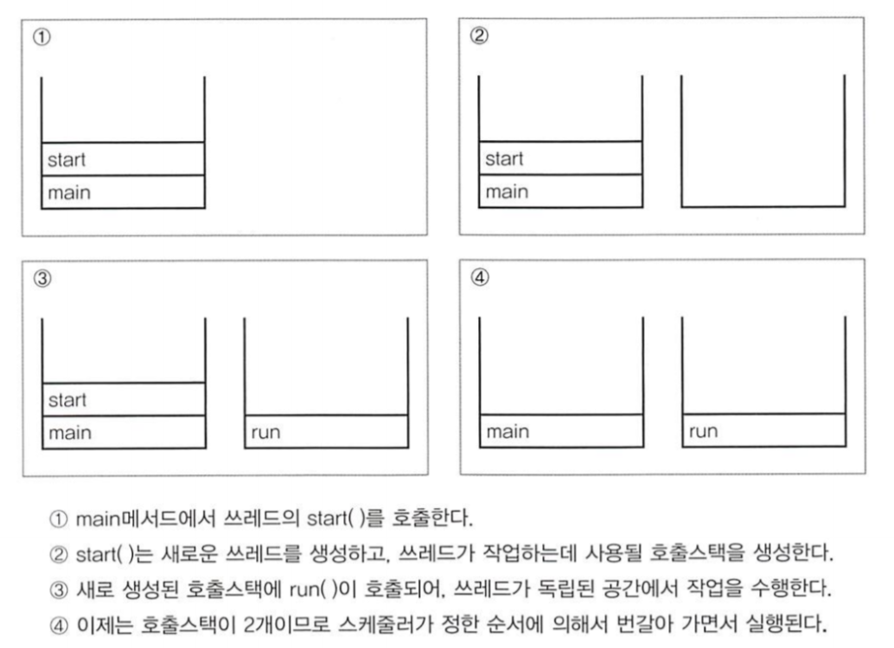

# [Week10] 멀티쓰레드 프로그래밍


## 학습할 것

- Thread 클래스와 Runnable 인터페이스
- 쓰레드의 상태
- Main 쓰레드
- 쓰레드의 우선순위
- 동기화
- 데드락


### 프로세스와 스레드 

- **프로세스**
  - 실행 중인 프로그램
    - 프로그램 실행 → OS에서 프로그램 코드를 메모리에 적재(할당) → 프로세스 생성
  - 각 프로세스의 데이터 접근이 불가능

- **스레드**
  - 하나의 프로세스에 여러 개의 스레드 생성 가능 -> 멀티 쓰레드 프로세스
  - 프로세스 안에 있으므로 해당 프로세스의 데이터에 모두 접근 가능
  - 실행 흐름에 대한 추상화
    - 각 스레드 별로 독립적으로 저장하는 항목들
      - 각기 다른 실행 흐름에 대한 정보를 저장하기 위해 
      - PC Register : 현재 실행되고 있는 명령의 위치 저장
      - JVM Stack : 실행 흐름에 대한 별도의 **스택**을 할당

| 쓰레드                       | 프로세스                  |
| ---------------------------- | ------------------------- |
| 프로세스의 subset            | 독립적                    |
| 쓰레드 간에 자원 공유가 가능 | 각각 독립적인 자원을 가짐 |
| 주소 영역을 공유             | 사적 주소공간             |
| 별도의 통신 방식 X           | IPC 통신                  |


### 왜 스레드를 사용하나?

- 멀티 스레드를 활용하면 사용자에 대한 응답성을 증가시킬 수 있다
  - `동시적인 특성` 에 의해 달성 가능
  - **동시성** : 여러 스레드를 실행할 때 병렬로 실행하는 것처럼 보일 때 동시성을 획득했다고 말할 수 있다. 실제로는 스레드를 번갈아가면서(context switching) 한 번에 하나의 스레드만 처리한다.
  - 예를 들어, 백그라운드 프로그램으로 게임을 다운 받으면서도 동시에 웹서핑을 할 수 있다.
- 프로세스 자원을 공유하기 때문에 경제적이다
- 단, 동기화 문제와 오버헤드 가능성에 유의해야 한다.
  - 동기화 문제(Synchronization) : race condition, dead
  - 오버헤드 문제 : 스레드 처리 시간보다 스케줄링 시간이 더 소요되는 오버헤드가 발생

### 쓰레드의 상태

#### **1. New**

- Thread 객체가 만들어졌지만 아직 시작은 되지 않은 상태
- NOT started, NOT runnable
- not known to thread scheduler(CPU는 점유하고 있지 않은 상태)

#### **2. Runnable**

- 실행 중 혹은 실행 가능한 상태
- Thread 객체가 start() 호출한 뒤의 상태
- can be scheduled (CPU 점유권을 얻을 수 있는 상태, 아직 얻진 않음)

#### **3. Running**

- JVM에 의해 run()이 호출된 상태
- scheduled ( CPU를 점유해서 실행중인 상태 )

#### **4. Blocked**

- Runnable → Unrunnable
- 스케줄링 될 수 없는 상태 
  - lock 메소드(sleep()과 같이)로 전환
  - CPU 점유권 상실
- cannot be scheduled

#### **5. Dead**

- run() 메소드를 모두 수행한 뒤의 상태
- cannot be rescheduled


#### (+) start()와 run()



- start() 호출 시
  - New ➡️ Runnable
  - 새로운 스레드 객체 생성과 함께 call stack 생성
  - 실행 대기 상태(스레드 스케줄러에 스케줄링이 가능한 상태)
- run() 호출 시
  - Runnable ➡️ Running
  - 실제 작업 시작(스레드 스케줄러에 스케줄링된 상태)

- 사진 출처 - 자바의 정석 기초편

### 스레드 구현 방법 - Thread 클래스와 Runnable 인터페이스

#### Thread 클래스 상속

- extends Thread
- run() 오버라이딩
- (-) 다른 클래스를 상속받을 수 없다

```java
public class ThreadExample {
    public static void main(String[] args) {
        CustomThread thread = new CustomThread();
        thread.start();
    }
}

class CustomThread extends Thread {
    @Override
    public void run() {
        // .. 해당 스레드가 수행할 로직
    }
}

```


 #### Thread 생성자로 Thread 구현

```java
// 1. 기본 생성자 구현
Thread thread = new Thread();

// 2. 스레드 이름 설정
Thread thread = new Thread("new-thread-name");

// 3. Runnable 인터페이스를 인자로 받아 구현
Thread thread = new Thread(new Runnable() { 
  @Override
  public void run() {
    System.out.println("Instantiate Thread with Runnable instance");
  }
});

// 4. Runnable 인터페이스를 인자로 받는 동시에 스레드 이름 설정
Thread thread = new Thread(new Runnable() { 
  @Override
  public void run() {
    System.out.println("Instantiate Thread with Runnable instance");
  }
}, "new-thread-name");
```


#### Runnable 인터페이스 구현

- implements Runnable, run() 구현
- 재사용성 높고 일관성 유지하기 쉽다(인터페이스이므로) → 객체지향적인 방식
- 구현한 runnable을 thread 생성자의 매개변수로 넘겨주어야 한다.

```java
public class ThreadExample {
    public static void main(String[] args) {
        Runnable runnable = new CustomRunnable();
        Thread thread = new Thread(runnable);
        thread.start();
    }
}

class CustomRunnable implements Runnable {
    @Override
    public void run() {
        // .. 해당 스레드가 수행할 로직
    }
}
```


### Main 쓰레드

- 자바 프로그램이 실행될 때 가장 먼저 생성되는 스레드를 메인 스레드라고 한다.

- main이 수행을 마치더라도 다른 스레드가 아직 작업을 마치지 않았다면 프로그램은 종료되지 않는다.
  - 사용자 스레드(user thread)
  - 데몬 스레드(deamon thread) : 일반 스레드들이 종료되면 자동으로 데몬 스레드도 종료.
    -  일반 스레드의 보조 역할을 담당
    - `setDaemon()` 으로 데몬 스레드 설정
    - `isDaemon()`으로 현재 스레드가 데몬 스레드인지 확인


### 쓰레드의 우선순위

- 자식 스레드는 부모 스레드의 우선순위를 상속받는다
  - 스레드 클래스 내부에 priority 필드가 존재하고, `parent.getPriorty()` 로 부모 클래스의 우선순위 값을 그대로 할당한다
  - 

- 메인 스레드의 기본 우선순위는 5
- 레드가 가질 수 있는 우선순위의 범위는 1~10
- 높은 숫자 == 높은 우선순위

#### 우선순위 관련 메소드 및 필드

- 필드

  - ```java
    // 스레드가 가질 수 있는 우선 순위 최소값
    public final static int MIN_PRIORITY;
    // 스레드가 가지는 기본 우선 순위 값
    public final static int NORM_PRIORITY;
    // 스레드가 가질 수 있는 우선 순위 최대값
    public final static int MAX_PRIORITY; 
    ```

- 메소드

  - ```java
    // 우선순위 지정
    setPriority(int newPriority);
    // 스레드의 우선순위 리턴
    getPriority();
    ```

    

### 동기화

여러 스레드가 프로세스의 자원을 공유한다는 점이 경제적인 측면에서는 장점이지만 데이터 무결성을 해칠 수 있다는 단점이 있다. 특히 여러 thread가 동일한 자원을 동시에 접근할 때 문제가 발생한다.

스레드 간에 공유하는 데이터가 서로의 작업에 영향을 미치면 안 되기 때문에 멀티 스레드 환경에서는 동기화 처리가 필요하다. 

- 동기화란,  작업들 사이에 시기를 맞추는 것

- 데이터 무결성 : 모든 작업에 있어 데이터의 정확성, 일관성이 유지되는 특성

#### 1. 동기화 문제 해결 

#### 1-1. synchronized 키워드 활용

synchronized 키워드는 크게 두 가지 영역에서 사용이 가능하다.

1. **synchronized 메서드**

   - 메서드 전체를 임계 영역으로 설정

   - 메소드 종료 시 쓰레드는 lock을 반환

2. **synchronized 블럭**

   - 락을 걸고자 하는 객체의 참조 값을 synchronized 키워드로 감싼다

   - 블럭 종료 시 쓰레드는 lock을 반환

```JAVA
// 메서드 전체를 임계영역으로 설정
public synchronized void syncMethod () {
    ......
}

// 특정한 영역을 임계영역으로 설정
synchronized(객체의 참조변수) {
    ......
}
```

#### 1-2.  Atomic action 

Atomic action이란, 해당 작업이 도중에 멈추는 일 없이, 완전히 모두 실행되거나 아예 발생하지 않거나 둘 중 하나의 상태를 가지도록 하는 액션을 말한다.  한 마디로 모든 관련있는 작업들이 한꺼번에 일어나는 작업이다. 이를 달성하는데 주로 voliate 키워드나 atomic 변수를 활용한다.

#### voliate 키워드

- Java 변수를 Main Memory에 저장하여 모든 스레드가 해당 voliate 변수의 모든 수정 사항들을 공유한다.
- (-) 모든 스레드가 동일한 변수를 공유하고 있기 때문에 해당 변수가 외부에서 변경되면 사용하고 있는 모든 스레드가 영향을 받기 때문에 side effect가 발생할 수 있기 때문에 잘 사용해야 한다.

#### Atomic Variables

- [`java.util.concurrent`](https://docs.oracle.com/javase/8/docs/api/java/util/concurrent/package-summary.html) package 에 존재하는 클래스를 활용

- 멀티 스레드 환경에서 변수값을 참조할 때 메인 메모리가 아닌 CPU 캐시에 있는 값을 참조한다. 때문에 동시성 문제로 CPU 캐시에서 잘못된 값을 참조하는 경우가 있을 수 있다.

- CAS(Compared And Swap) 알고리즘 : 현재 쓰레드에 저장된 값과 메인 메모리에 저장된 값을 비교하여 

  1. 일치하는 경우 새로운 값으로 교체

  2. 일치하지 않는다면 실패 후 재시도

  

예를 들어 아래와 같이 `synchronized` 키워드로 동시성 문제를 아래와 같이 해결해 줄 수 있다.

```java
class SynchronizedCounter {
    private int c = 0;

    public synchronized void increment() { c++; }

    public synchronized void decrement() { c--; }

    public synchronized int value() { return c; }
}
```

하지만, liveness (deadlock, race condition) 문제가 발생할 수 있다는 점 때문에 클래스가 크고 복잡해지게 된다면 아래와 같이 atomic 변수를 활용하는 것도 좋은 방법이다.

```java
import java.util.concurrent.atomic.AtomicInteger;

class AtomicCounter {
    private AtomicInteger c = new AtomicInteger(0);

    public void increment() {
        c.incrementAndGet();
    }

    public void decrement() {
        c.decrementAndGet();
    }

    public int value() {
        return c.get();
    }

}
```


#### (+) Account 예시

Account를 공유자원으로 가지고 두 개의 스레드가 Account의 밸런스가 음수가 되기 전까지 계속 출금을 하는 로직 구현

```java
public class SyncExample {
    public static void main(String args[]) {
        Runnable withdrawer = new WithdrawThread();
        Thread thread1 = new Thread(withdrawer, "Thread 1");
        Thread thread2 = new Thread(withdrawer, "Thread 2");
        thread1.start();
        thread2.start();
    }
}
```


```java
class WithdrawThread implements Runnable {
    Account account = new Account();
    @Override
    public void run() {
        while (account.getBalance() > 0) {
            // 100, 200, 300 중 임의의 값을 선택해서 출금
            int money = (int) (Math.random() * 3 + 1) * 100;
           // 1. 동기화 처리 X
            account.withdraw(money); 
           // 2. 메소드 단위로 동기화 처리 
            account.withdrawWithSyncMethod(money);
           // 3. 블럭 단위로 동기화 처리
            account.withdrawWithSyncBlock(money);
          
            System.out.println(Thread.currentThread().getName() + " thread, balance: " + account.getBalance());
        }
    }

}
```

1. 동기화 처리를 하지 않은 경우

   ```java
    if (balance >= money) {
         try {
               Thread.sleep(1000);
         } catch (InterruptedException e) {}
         balance -= money;
     }
   ```

   

   - 한 스레드가 음수 조건(if문)을 통과한 뒤 다른 스레드에게 제어권을 넘겨주게 되면 두 스레드가 모두 출금을 진행하게 되어 최종적인 balance가 음수가 될 가능성이 있다.


 2 & 3. 동기화 처리를 해준 경우

```java
// 동기화 메소드
    public synchronized void withdrawWithSyncMethod(int money) {
        if (balance >= money) {
            try {
                Thread.sleep(1000);
            } catch (InterruptedException e) {
            }

            balance -= money;
        }
    }

    // 동기화 블록
    public void withdrawWithSyncBlock(int money) {
        synchronized (this) {
            if (balance >= money) {
                try {
                    Thread.sleep(1000);
                } catch (InterruptedException e) {
                }

                balance -= money;
            }
        }
    }
```


- 정상적으로 작동


#### 2. 동기화 오버헤드

- lock 닫고 푸는데 시간이 오래걸리기 때문에 이로 인해 성능이 저하될 수 있다. 멀티 쓰레드의 장점을 제대로 살리지 못하는 경우가 생길 수 있다.


#### 3. synchronized 키워드는 자기자신에게만!

- (+) synchronized 키워드는 자기자신에만 걸어줄 수 있다. primitive, static 변수에는 걸어줄 수 없다.

```java
public static long result = 0;
synchronized(result){ // 컴파일 에러 발생 -> result가 object가 아니기 때문에 에러 발생
    result += i;
}
```


#### 4. wait & notify

특정 스레드가 객체의 락을 가진 상태로 오랜 시간 있지 않도록 해준다. 현재 스레드가 객체를 선점하느라 다른 스레드들이 객체를 필요로 하는 작업을 수행하지 못하는 상황이 발생할 수도 있기 때문이다.

1. 동기화된 임계구역 코드를 수행하는 도중 작업을 더 이상 진행할 수 없다면 wait() 호출하여 스레드가 객체에 대한 락을 반납하고 대기 상태가 된다.
2. 나중에 작업을 진행할 수 있는 상황이 되면 notify()를 호출해서 wait()를 통해 중단했던 쓰레드가 다시 락을 얻어 작업을 진행할 수 있게 된다.

```java
public synchronized void withdrawWithWait(int money) {
        while (balance < money) {
            try {
                wait();
            } catch (InterruptedException e) {
            }
        }
        balance -= money;
    }

    public synchronized void deposit(int money) {
        // balance 값을 업데이트하고난 뒤,
        // waiting pool의 쓰레드에게 작업 종료임을 알려주기
        balance += money;
        notify();
    }
```


### 데드락

아래 4가지 특성을 가지고 있는 경우를 데드락이라고 정의한다.

#### 1. 상호 배제 (Mutual exclusion)

- 자원은 한 번에 한 프로세스만이 사용할 수 있어야 한다.

 #### 2. 점유 대기 (Hold and wait)

- 최소한 하나의 자원을 점유하고 있으면서 다른 프로세스에 할당되어 사용하고 있는 자원을 추가로 점유하기 위해 대기하는 프로세스가 있어야 한다.

#### 3. 비선점 (No preemption)

- 다른 프로세스에 할당된 자원은 사용이 끝날 때까지 강제로 빼앗을 수 없어야 한다.

#### 4. 순환 대기 (Circular wait)

- 프로세스의 집합 {P1,P2…Pn-1, Pn}에서 P1는 P2가 점유한 자원을 대기하고 P2는 P3가 점유한 자원을 대기하고 ...  Pn은 P1이 점유한 자원을 요구해야 한다.
- 이렇게 각 프로세스는 순환적으로 다음 프로세스가 요구하는 자원을 가지고 있다.


### Reference

- 전체적인 참고
  - https://docs.oracle.com/javase/tutorial/essential/concurrency/atomic.html
  - https://docs.oracle.com/javase/tutorial/essential/concurrency/atomicvars.html
  - https://www.notion.so/ac23f351403741959ec248b00ea6870e
  - https://honbabzone.com/java/java-thread/
  - https://wisdom-and-record.tistory.com/48
  - https://sujl95.tistory.com/63

- main thread
  - https://www.geeksforgeeks.org/main-thread-java/