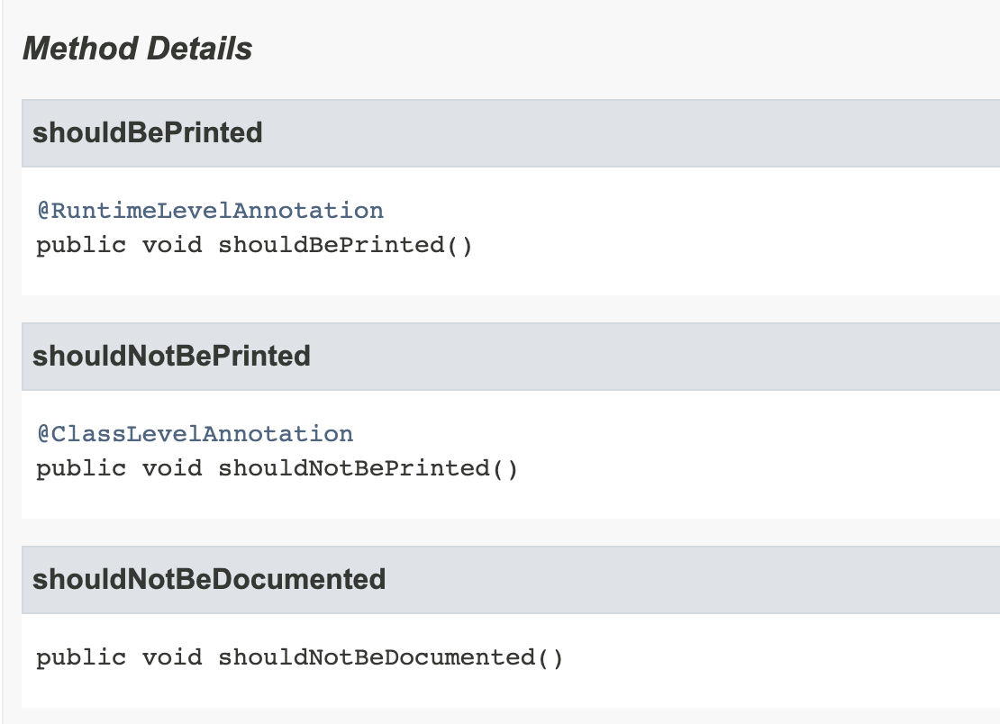

# 12주차 과제: 애노테이션

# 학습할 것 (필수)

- 애노테이션 정의하는 방법
- @Retention
- @Target
- @Documented
- 애노테이션 프로세서


## 어노테이션

주석과 같은 역할을 담당한다. 이와 더불어 선언된 대상(클래스, 필드 등)에 특정 의미를 부여하거나 기능을 주입하는 등 메타 데이터(데이터를 설명해주는 데이터)의 역할을 하기도 한다.

@ + <어노테이션 이름> 로 선언되는데, @ 사인을 통해 컴파일러에게 사인 뒤에 오는 것이 어노테이션이라는 것을 알려준다.

어노테이션은 element들을 포함할 수 있고 이름이 있을 수도, 없을 수도 있으며 element에 value를 설정할 수 있다.


### 어노테이션의 특징 

1. **Information for the compiler**

   - 컴파일 타임 체크가 가능하다

   - 에러나 주의사항들을 컴파일러에게 미리 알려주어서 런타임에 발생할 에러를 예방할 수 있다.

     

#### @Override 어노테이션 사용 예시

```java
class A {
  public void getDataFromDatabase(){
    System.out.println("from A");
  }
}

class B extends A {
  // 원래는 A의 메소드를 오버라이드하려고 했지만 Data'B'ase typo 발생
  public void getDataFromDataBase() {
    System.our.println("from B");
  }
}

public class Main {
  public static void main(String[] args){
   		B b = new B();
      b.getDataFromDatabase(); // from B 를 기대했지만 typo로 인해 from A 출력
  }
}

```


```java

// @Override 어노테이션을 사용해서
class B extends A {
  @Override // 컴파일 타임에 typo checking 가능
  public void getDataFromDatabase() {
    System.our.println("from B");
  }
}
```


2. **Compile-time and deployment-time processing**

   - 어노테이션을 통해 소프트웨어 개발 툴이 **자동으로 코드를 생성**할 수 있게 정보를 제공한다.

   - 어노테이션으로 개발과정에서 생략할 수 있는 코드가 많아지고, 재사용이 가능해지기 때문에 전체적인 코드가 더 깔끔해진다.

3. **Runtime processing**(런타임 프로세싱) 가능

   - 몇몇 어노테이션들은 **런타임에 실행**할 수 있다. 

   - 즉, reflection 기능을 이용해서 런타임 환경에서도 선언된 어노테이션들에게 접근할 수 있다.
   - 어노테이션을 통해 런타임에 프로그램에게 명령을 줄 수도 있다.


### 어노테이션 사용

1. Declaration( 선언부 )

- 클래스, 필드, 메소드, 그리고 다른 프로그램 요소들을 선언할 때 어노테이션을 사용할 수 있다.


2. Type use ( 사용 타입 ) - java 8부터 적용 가능

   - Class instance creation expression ( 인스턴스 생성 구문 )

     ```java
     new @Interned MyObject();
     ```

   - Type casting ( 타입 캐스팅 )

     ```java
     myString = (@NonNull String) str;
     ```

   - implements clause ( 상속 구문 )

     ```java
     class UnmodifiableList<T> implements
             @Readonly List<@Readonly T> { ... }
     ```

   - Thrown exception declaration ( 예외 던지는 선언 구문 )

     ```java
        void monitorTemperature() throws
             @Critical TemperatureException { ... }
     
     ```


### 기본 제공 어노테이션

1. **Built-in Annotation** - 자바에서 기본으로 제공하는 어노테이션

   | 어노테이션 종류      | 역할                                                         | 컴파일러                                            |
   | -------------------- | ------------------------------------------------------------ | --------------------------------------------------- |
   | @Override            | 선언 메소드가 오버라이드된 메소드라는 것을 나타낸다          | **error** might be caused                           |
   | @Deprecated          | 더 이상 사용되지 않는 메소드임을 나타낸다                    | **warning** might be caused                         |
   | @SuppressWarnings    | 컴파일러에 의해 발생하는 자잘한 주의사항들을 무시하도록 한다 | X                                                   |
   | @FunctionalInterface | 람다함수를 위한 인터페이스 지정(Java8부터 사용 가능), 메소드가 반드시 하나여야 한다. | 메소드가 없거나, 두 개 이상일 경우 컴파일 에러 발생 |

#### (+) SuppressWarnings

- `unchecked` - 확인되지 않은 작동(operation)과 관련된 경고 무시
- `deprecation` - deprecated 된 기능 사용 시 발생하는 경고 무시


2. **Meta Annotation** - 커스텀 어노테이션을 만들 때 사용하는 어노테이션

| 어노테이션 종류 | 역할                                         |
| --------------- | -------------------------------------------- |
| @Retention      | 어노테이션 유지 기간 지정                    |
| @Target         | 어노테이션 적용 위치 지정                    |
| @Documented     | 어노테이션이 붙은 대상을 @javadoc에 포함시킴 |
| @Inherited      | 어노테이션 상속                              |


### (+) Repeating Annotations - 연속 어노테이션 (java 8 부터 등장)

아래와 같이 어노테이션을 여러 번 적용할 수 있게 하는 기능이 java 8부터 추가 되었다.

```java
@Schedule(dayOfMonth="last")
@Schedule(dayOfWeek="Fri", hour="23")
public void doPeriodicCleanup() { ... }
```


이를 사용하기 위해서는 크게 두 가지 과정을 거쳐야 한다

1. Repeatable Annotation 선언

- @Repeatable이라는 메타 어노테이션을 통해 자바 컴파일러가 연속적으로 할당되는 어노테이션을 저장할 수 있도록 한다.

- 예를 들어 아래 예시에서는 Schedules 어노테이션 안에 연속으로 @Schedule 어노테이션이 저장된다. 

  ```java
  import java.lang.annotation.Repeatable;
  
  @Repeatable(Schedules.class)
  public @interface Schedule {
    String dayOfMonth() default "first";
    String dayOfWeek() default "Mon";
    int hour() default 12;
  }
  ```

2. 연속적인 어노테이션을 담는 어노테이션(Containing Annotation)을 정의한다.

   - containing annotation은 반드시 value element를 배열 타입으로 가지고 있어야 한다. 

   - 그리고 해당 배열의 타입은 반드시 repeatable annotation 타입이어야 한다.

     ```java
     public @interface Schedules { // Containing Annotation 선언
       Schedule[] value(); // Repeatable Annnotation을 배열로 가지고 있다
     }
     ```


## 어노테이션 정의하는 방법

1. @interface 키워드를 통해서 어노테이션 이름 설정
2. 추상 메소드 형태로 어노테이션에 element을 선언
3. 모든 어노테이션들은 `java.lang.annotation.Annotation` 인터페이스를 상속받고 있기 때문에 별도의 extends 구문이 필요하지 않다.


#### 어노테이션 정의 규칙

- 허용되는 element type - primtive type, String, annotation, class
- element 정의 시, 매개변수 선언 X
- 예외 선언 불가
- 요소의 타입에 제너릭 사용 금지

```java
@interface DoNotThis {
  String id = "상수선언가능";
  String noParams(int i); // 매개변수 선언 불가
  String noExceptionThrowing() throws Exception; // 예외 선언 불가
  ArrayList<String> noTypeParams(); // 타입 매개변수 선언 불가
}
```


#### 어노테이션 종류 및 구현 방법

1. Marker Annotation

   - element가 정의되어있지 않는 빈 annotation

     ```java
     @interface CustomAnnotation { }
     ```

   - ex ) @Override 혹은 @Deprecated

2. Single-Value Annotation

   - element(-> 사실 추상 메소드)가 하나 정의되어있는 annotation

     ```java
     @interface CustomAnnotation { 
     	 String value();
     }
     
     @interface CustomAnnotation { 
     	 int value() default 0;
     }
     ```

   - 실제 해당 어노테이션을 사용하는 방식은 아래와 같다

     ```java
     @CustomAnnotation(value=10)
     ```

     

3. Multi-Value Annotation
   - element(-> 사실 추상 메소드)가 둘 이상 정의되어있는 annotation
   - 예시는 생략 2번에서 element만 하나 더 추가된 형태


## @Retention

어떻게 표기된 어노테이션을 저장할지를 명시하는 어노테이션. 즉, 해당 어노테이션의 지속 기간을 지정할 수 있다.

| 유지 정책                 | 설명                                                         | source | compiler | JVM  |
| ------------------------- | ------------------------------------------------------------ | ------ | -------- | ---- |
| `RetentionPolicy.SOURCE`  | 해당 어노테이션은 소스 코드에서만 유지되고, 컴파일러에 의해 무시된다. | O      | X        | X    |
| `RetentionPolicy.CLASS`   | 해당 어노테이션은 컴파일러에 의해 컴파일 타임까지 유지되고 JVM에 의해서 런타임에는 무시된다. | O      | O        | X    |
| `RetentionPolicy.RUNTIME` | 런타임 환경에서도 계속 유지된다.                             | O      | O        | O    |

- SOURCE :  컴파일 이후에는 어노테이션이 사라진다. 따라서 자바 바이트 코드에 남아있지 않다.
- CLASS (defualt) : 자바 바이트 코드에는 남아있지만(컴파일 시에는 어노테이션을 메모리에 할당하지만), JVM이 런타임 환경에서 어노테이션 데이터를 가져올 수는 없다.
- RUNTIME : 유지 정책을 runtime으로 지정하게 될 경우 런타임 환경에서도 메모리에 있는 어노테이션 데이터를 가져올 수 있기 때문에 reflection을 사용해서 확인해볼 수도 있다!


## @Target

해당 어노테이션이 어떤 자바 element에 적용이 되는지를 명시해주는 어노테이션이다.

| 타겟 상수 값                  | 적용 타겟          |
| ----------------------------- | ------------------ |
| `ElementType.ANNOTATION_TYPE` | 어노테이션 타입    |
| `ElementType.CONSTRUCTOR`     | 생성자             |
| `ElementType.FIELD`           | 필드 혹은 속성     |
| `ElementType.LOCAL_VARIABLE`  | 지역 변수          |
| `ElementType.METHOD`          | 메소드 레벨        |
| `ElementType.PACKAGE`         | 패키지 선언부      |
| `ElementType.PARAMETER`       | 메소드 파라미터    |
| `ElementType.TYPE`            | 클래스의 모든 요소 |


## @Documented

@Documented는 javadoc에 해당 어노테이션을 javadoc에 표기하도록 지정하는 어노테이션


#### @Documented를 적용하지 않은 어노테이션

```java
@Retention(RetentionPolicy.RUNTIME)
@Inherited
@interface NotDocumentedAnnotation {
    String action() default "not documented";
}
```


```java
class CustomClass {
    @RuntimeLevelAnnotation
    public void shouldBePrinted() {
        System.out.println("Annotation should be printed!");
    }

    @ClassLevelAnnotation
    public void shouldNotBePrinted() {
        System.out.println("Annotation should not be printed!");
    }

    @NotDocumentedAnnotation
    public void shouldNotBeDocumented(){
        System.out.println("I am not documented");
    }

}
```


#### 생성된 javadocs

- [ intellij 기준 javadocs 생성법 ] tools > generate JavaDoc



@Document가 적용된 어노테이션인 @RuntimeLevelAnnotation과 @ClassLevelAnnotation은 javadocs에 표기가 된다.

반면 @Document를 따로 적용하지 않은 @NotDocumentedAnnotation의 경우 javadocs에는 표기되지 않는다.


## 어노테이션 프로세서

- javac 에 속한 빌드 도구
- 어노테이션 프로세싱은 컴파일 시간에 어노테이션들을 스캐닝하고 프로세싱
  - 컴파일 중에 새로운 코드를 만들거나 기존의 코드 변경이 가능
- 특정 어노테이션들을 위해 어노테이션 프로세서를 만들어서 등록할 수 있다.

- 컴파일 시점에 조작하기 때문에 **런타임 비용이 들지 않는다**

- 예시
  - 롬복의 @Getter @Setter @Builder 등도 어노테이션 프로세서를 사용
  - @Override 어노테이션이 붙은 메소드를 확인해서 컴파일 타임에 체크를 해주는 것도 어노테이션 프로세서가!


## Reference

https://docs.oracle.com/javase/tutorial/java/annotations/

- 어노테이션 정의 방법
  - https://beginnersbook.com/2014/09/java-annotations/

- @Inherited
  - https://stackoverflow.com/questions/23973107/how-to-use-inherited-annotation-in-java/23973331

- @Document
  - https://blog.naver.com/swoh1227/222229853664