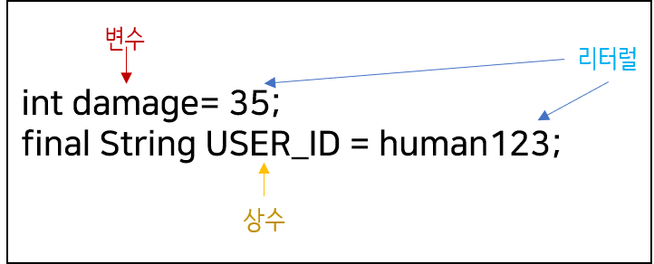

# 2주차 과제: 자바 데이터 타입, 변수 그리고 배열


자바의 프리미티브 타입, 변수 그리고 배열을 사용하는 방법을 익힙니다.


[TOC]

---

### 프리미티브 타입 종류와 값의 범위 그리고 기본 값

---


| 종류/크기 |            1 byte ( = 8 bit)            |                  2 byte                   |                   4 byte                   |                    8 byte                    |
| :-------: | :-------------------------------------: | :---------------------------------------: | :----------------------------------------: | :------------------------------------------: |
|  논리형   | boolean (false/true)<br />기본값: false |                                           |                                            |                                              |
|  문자형   |                                         | char ( 0 ~ 65535)<br /> 기본값: "\u0000"  |                                            |                                              |
|  정수형   |    byte (-128 ~ -127)<br />기본값: 0    | short ( -32,768 ~ 32,767)<br /> 기본값: 0 |      int (약 +- 20억)<br />기본값: 0       |    long ( -2^63 ~ 2^63-1)<br />기본값: 0     |
|  실수형   |                                         |                                           | float (1.4E-45 ~ 3.4E38)<br />기본값: 0.0f | double (4.9E-324 ~ 1.8E308)<br />기본값: 0.0 |


---

### 프리미티브 타입과 레퍼런스 타입

---


##### 기본형(primitive type)

- 8개: boolean, char, byte, short, int, long, float, double

- 계산을 위한 실제 값을 저장한다.

- OS에 따라 자료형의 길이가 변하지 않는다.

- 비객체 타입으로 `null` 값을 가질 수 없다.

- Java Stack의 Stack Frame 안에 그대로 저장된다.

  

##### 참조형(reference type)

- 8개의 기본형을 제외한 나머지 타입
- `class`, `interface`, `enum`, `Array`, `String type`  ...
- 객체의 주소를 저장
- 참조형은 `java.lang.Object` 를 상속받는다.


---

### 리터럴(literal)

---


##### 리터럴은 변하지 않는 값을 뜻함.

##### 원래 50, 3.14, 'A'와 같은 값들이 '싱수'인데,

##### 프로그래밍에서는 '값을 한 번 저장하면 변경할 수 없는 공간'으로 상수(Constant)로 정의했기 때문에 이와 구분하기 위해 상수를 리터럴이라 용어를 사용한다.





---

### 변수 선언 및 초기화하는 방법

---


```java
타입 변수명 = 저장할 값;
```

``` java
int age = 26;  
```

- 변수에 값을 저장할 때는 대입 연산자 `=`  이용

  

---

### 변수의 스코프와 라이프타임

---

##### 

##### 지역변수

```java
public void method(){
	int age = 10;
}
```


- 메서드가 호출되어 Stack에 push 된 경우, Stack Frame 내의 Local Variable 에 저장됨.
- 메서드가 종료될때, Stack Frame도 `pop` 이되면서 변수의 라이프 타임 종료
- 스코프 : 메소드 블락`{}` 내


##### 클래스 내 전역 변수

```java
public class noel{
    	public static int age = 20;
}
```

- Runtime Data Area -> Method Area 의 Class Variable 에 저장됨.

- 스코프 : 어디든 (접근제어자에 따라 달라짐)

  

##### 객체

- 가비지 컬렉터가 수집하는 순간 라이프타임 종료
   - https://www.youtube.com/watch?v=vZRmCbl871I
   - https://www.notion.so/Week1-JVM-79047914fae5407190959a6cbe802ac3


---

### 타입 변환, 캐스팅 그리고 타입 프로모션

---


##### 타입변환(캐스팅)

- 변수 또는 상수의 타입을 다른 타입으로 변환 하는 것

```java
(타입) 피연산자
```

```java
double  d = 85.4;
int score = (int)d;  // double 타입의 변수 d를 int 타입으로 변경
```

* 피연산자인 변수 d의 값은 형변환 후에도 아무런 변화가 없다.


##### 자동 형변환(타입 프로모션)

- 편의상의 이유로 타입변환을 생략할 수 있다.
- 형변환이 이루어지지 않는 것은 아니고, 컴파일러가 타입변환을 자동적으로 추가함.
- 보통 작은 타입을 큰 타입에 넣으려고 할 때 발생함

```java
int i = 3;
double d = 1.0 + i;
```


- 변수가 저장할 수 있는 값의 범위보다 더 큰 값을 저장하려는 경우에 형변환을 생략하면 에러 발생

```java
byte b = 1000;    // 에러. byte 범위 (-128 ~ 127) 초과
```


---

### 1차 및 2차 배열 선언하기

---


##### CASE 1 : 일반적인 2차원 배열

```java
int[][] temp = new int[][];
```


##### CASE 2 : ArrayList (1) Integer 이용

```java
ArrayList<Integer[]> list = new ArrayList<Integer[]>();   
 
        list.add(new Integer[]{1,2,3});                                     
        list.add(new Integer[]{4,5,6});                                      
 
        System.out.println(list.get(0)[0]); // 출력예시
```


##### CASE 3 : ArrayList (2) List 중첩

```java
List<List<Integer>> arr = new ArrayList<>();

        for (int i = 0; i < n; i++) {
            String[] arrRowTempItems = (생략..);

            List<Integer> arrRowItems = new ArrayList<>();

            for (int j = 0; j < n; j++) {
                int arrItem = Integer.parseInt(arrRowTempItems[j]);
                arrRowItems.add(arrItem);
            }

            arr.add(arrRowItems);
        }

	  System.out.println(arr.get(1)); // 출력예시
	  System.out.println(arr.get(1).get(0)); // 출력예시
```


---

### 타입 추론, var

---


타입추론은 Generic 이나 Lambda를 사용할 때 들어본 단어

- 타입추론이란 코드 작성 당시 타입이 정해지지 않았지만, 컴파일러가 그 타입을 유추하는 것을 말함.


Java 10부터 `var` 라고 하는 Local Variable Type-Interference 가 추가됨.


```java
// Java 9 이하
String name = "노을";

// Java 10 이상
var name = "노을";
```


뭔가 나중에 디버깅하기 어려울 것 같다...


---

### 참고

---


자바의 정석 - 저자: 남궁성

https://github.com/study-whiteship/study-whiteship/tree/master/week2/roach

https://b-programmer.tistory.com/225
