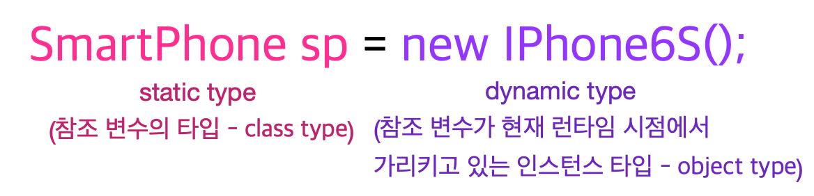

# 6주차 과제: 상속

## 학습할 것

- 자바 상속의 특징
- super 키워드
- 메소드 오버라이딩
- 다이나믹 메소드 디스패치 (Dynamic Method Dispatch)
- 추상 클래스
- final 키워드
- Object 클래스


## 자바 상속의 특징

자바 언어에서 클래스는 다른 클래스로부터 파생될 수 있다. 다른 클래스의 필드나 메소드를 상속받는 형태로 파생되는데 이렇게 상속을 받는 클래스를 subclass(derived class, extended class, child class), 상속을 하는 클래스를 superclass(base class, parent class)라고 한다. 자바에서는 단일 상속만을 허용하고 있어


A가 B를 상속받는다고 한다면, A는 B에서 확장된 클래스라고 보아도 좋다.

- inherits definitions of all attributes and methods

  먼저 A는 B의 모든 속성과 메소드를 상속받는다. 

  (이런 방식으로 코드를 재사용할 수 있다.  코드 중복을 막기 위해서 공통된 속성과 메소드를 상위 클래스로 올려서 상속을 통해 중복을)

- defines new attributes and methods if necessary

  "확장된" 클래스라고 이야기할 수 있는 이유가 여기에 있다. A 클래스는 상속받은 속성과 메소드와 더불어 새로운 속성과 메소드를 정의할 수 있다.

- Redefines/overrides methods if necessary

  A 클래스는 상속받은 메소드를 재정의하거나 오버라이드 할 수 있다. 메소드 시그니처와 리턴타입이 동일하면 된다.

  이런 특성 덕분에 우리는 코드 구조를 변경하지 않고 maintainability를 취할 수 있다.

  

  예를 들어

  ```java
  Course c1 = new Course ("CES 114");
  Student student = new ResidentStudent("John");
  // Student에 정의된 메소드 사용
  student.register(c1);
  // 이후 학생들 중 ResidentStudent에 한해서 register() 로직을 변경하고 싶을 경우,
  // ResidentStudent 클래스 내부에서 register()를 재정의하더라도, 코드 자체는 변하지 않는다. -> maintainable 👍
  ```

  

## super 키워드

1. `super` :  super는 수퍼클래스의 참조변수
   - 상속받은 멤버 변수와 자손 클래스의 멤버변수의 이름이 같을 때는 super를 붙여서 구별

```java
public class Superclass {

    public void printMethod() {
        System.out.println("Printed in Superclass.");
    }
}

public class Subclass extends Superclass {

    // overrides printMethod in Superclass
    public void printMethod() {
        super.printMethod(); // ⭐️⭐️⭐️
        System.out.println("Printed in Subclass");
    }
    public static void main(String[] args) {
        Subclass s = new Subclass();
        s.printMethod();    
    }
}

```


2. `super()` 혹은 `super(parameter list)`: 수퍼클래스의 생성자
   - 상속을 받더라도 생성자는 따로 상속되지 않는다
   - 따라서, superclass에서 정의된 멤버 변수들은 superclass의 생성자인 super()를 통해서 초기화되도록 작성하는 것이 좋다.

```java
public MountainBike(int startHeight, 
                    int startCadence,
                    int startSpeed,
                    int startGear) {
    super(startCadence, startSpeed, startGear);
    seatHeight = startHeight;
}   
```


## 다이나믹 메소드 디스패치 (Dynamic Method Dispatch)

### 메소드 디스패치란(Method Dispatch)?

어떤 메소드를 호출할 것인가를 결정하는 매커니즘이다.

### 그럼 다이나믹 메소드 디스패치 (Dynamic Method Dispatch)란?

**런타임**에 어떤 오버라이드된 메소드를 호출할 것인가를 결정하는 매커니즘. 자바가 다형성을 지원하는 방식 중 하나다.

만약 오버라이드된 메소드가 super class 참조변수에 의해 호출이 될 때, 다이나믹 타입을 보고 어떤 메소드를 가져올지 선택하는 것

```java
class A {
  /* equals not overidden */
}
class B extends A {
  /* overidden version */
}
class C extends B {
  /* equals not overidden */
}
```


```java
Object c1 = new C();
Object c2 = new C();
c1.equals(c2); // 👈 B가 오버라이드 한 equals() 메소드를 호출

c1 = new A();
c1.equals(c2); // 👈 하지만 런타임에 c1의 다이나믹 타입이 A로 변경되었을 경우 가장 상위 클래스인 Object의 equals() 메소드를 호출
```


#### 다이나믹 타입(Dynamic Type)?




## 메소드 오버라이딩

### 오버라이딩(overriding)이란?

  **super class로부터 상속받은 메서드의 내용을 변경하는 것**을 오버라이딩이라고 한다. 상속받은 메서드를 그대로 사용하지 않고, 자신에 맞게 변경해야하는 경우가 많다. 이럴 때 상속받은 메소드를 오버라이드를 통해 재정의한다.

### 오버라이딩 조건

1. 접근 제어자는 super class의 메소드보다 좁은 범위로 변경할 수 없다

   - 예를 들어 super class 메소드의 접근 제어자가 protected라면, 이를 상속받아 오버라이드 하는 subclass 메소드의 접근 제어자는 protected 혹은 public이어야 한다.

2. 예외는 super class의 메소드보다 많이 선언할 수 없다.

3. 메소드 시그니처가 super class의 메소드와 일치해야 한다.

   

## 추상 클래스

- 공통된 속성이나 행위를 추상 클래스로 분리한다.

추상클래스는 `abstract` 이라는 키워드를 통해 선언된다. 추상클래스는 인스턴스화될 수는 없지만 subclass는 될 수 있다.

```java
public abstract class GraphicObject {
   // declare fields
   // declare nonabstract methods
   abstract void draw();
}
```


### 인터페이스와의 차이?

However, with abstract classes, you can declare fields that are not static and final, and define public, protected, and private concrete methods.

static이나 final이 아닌 필드 변수들을 선언할 수 있고 concrete 메소드를 정의할 수 있다는 점에서는 인터페이스와 차이를 보인다.

## final 키워드

`final` 키워드를 통해서 해당 대상을 변경 불가능한 상태로 만든다.

`final` 이 사용될 수 있는 곳은 클래스, 메소드, 멤버변수, 지역변수 이다.

| 대상      | 의미                                                         |
| --------- | ------------------------------------------------------------ |
| 클래스    | 확장될 수 없는 클래스가 된다. final로 지정된 클래스는 다른 클래스의 superclass가 될 수 없다. |
| 메소드    | 오버라이딩이 불가능한 메소드가 된다 (재정의, 변경이 불가능한 메소드) |
| 멤버 변수 | 값을 변경할 수 없는 상수                                     |
| 지역 변수 | 값을 변경할 수 없는 상수                                     |


```java
final class MyFinalClass { // super class가 될 수 없는 MyFinalClass
  final int MEMBER_FINAL = 1; // 상수화된 멤버 변수
 
  final void finalMethod() {  // 오버라이딩(재정의) 불가능한 메소드
    final int LOCAL_FINAL = 5;  // 상수화된 지역 변수
  }
  
}
```


## Object 클래스

모든 클래스는 implicitly `Object` 클래스의 child/sub class이다 (Object 클래스 제외). 이 덕분에 우리는 Object 클래스의 두 가지 accessor method를 언제든 오버라이드 할 수 있다. 


### ？👀 난 Object 클래스를 import 한 적이 없는데?

java.lang 패키지에 있는 클래스들은 import 문 없이 사용할 수 있다. 그리고 Object 클래스는 이 java.lang 패키지 내부에 있다. 클래스 파일을 컴파일하면 컴파일러는 코드에 자동적으로 `extends Object`를 추가한다(다른 상속 클래스가 없을 경우)

### 1. equals()

Object 내부에서는 equals()가 아래와 같이 정의되어 있다.

```java
boolean equals (Object other) { return (this == other); }
```

따라서 객체가 reference 타입인데 equals 메소드를 통해서 값을 비교하고 싶을 경우는 equals() 메소드를 재정의해주어야 한다.

### 2. hashCode()

객체 주소 값을 해싱해서 만든 해시코드를 리턴한다. 때문에 서로 다른 객체라면 절대 같은 해시 코드를 가질 수 없다. 단 String 클래스의 경우 리터럴이 같다면 동일한 해시코드를 리턴하도록 오버라이딩 되어있다. 이 경우를 제외하고 VO(Value Object)를 만들고 싶다면 hashCode() 오버라이딩을 잊지 말자 

### 2. toString()

해당 객체의 문자열 정보를 반환한다. Object 내부에서는 아래와 같이 toString()이 정의되어있다.

```java
public String toString() {
   return getClass.getName() +"@" +Integer.toHexString(hashCode());
}
```

toString()을 오버라이딩 하지 않는다면 위와 같이 인스턴스의 클래스 이름과 해시코드를 얻을 수 있다. toString()을 통해 좀 더 유의미한 정보를 얻고싶다면 오버라이딩을 해보자.


## 참조

- https://docs.oracle.com/javase/tutorial/java/IandI/subclasses.html

- 자바의 정석 기초편

#### 다이나믹 디스패치

- https://blog.naver.com/swoh1227/222181505425

- https://www.studytonight.com/java/dynamic-method-dispatch.php#:~:text=Dynamic%20method%20dispatch%20is%20a,of%20object%20it%20refer%20to.

